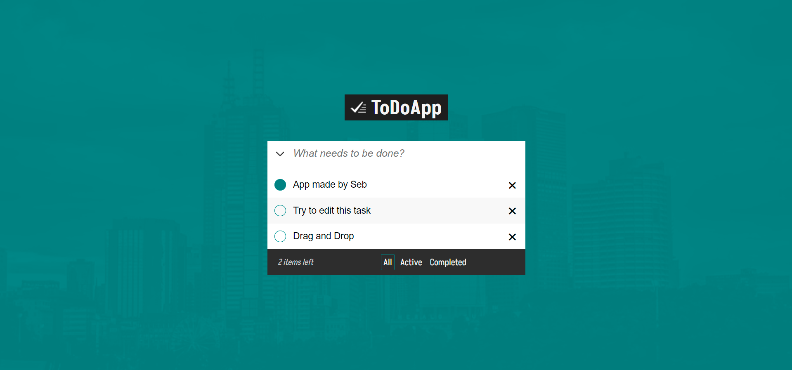

<!-- PROJECT LOGO -->
 

  

<h3 align="center">ToDoApp</h3>

  

    My very first application completely made in React.
  

<!-- ABOUT THE PROJECT -->
## About The Project

  
  It took me some time to understand how states work, but I finally succeded. I also explored a bit the world of NodeJs and MongoDB succesfully creating a simple database for the ToDos that anyone can edit. 
            For the Drag and Drop, I used [React Beautiful DnD](https://github.com/atlassian/react-beautiful-dnd) that was very simple to install and apply to my project.

(<a href="#top">back to top</a>)

### Built With
* [React.js](https://reactjs.org/)
* [Express.js](https://expressjs.com/)
* [MongoDB](https://www.mongodb.com/)

(<a href="#top">back to top</a>)

<!-- CONTACT -->
## Contact

Seb Herrera - [sebherrerabe](https://www.linkedin.com/in/sebherrerabe/) - sebastianherrerac1997@gmail.com

(<a href="#top">back to top</a>)

